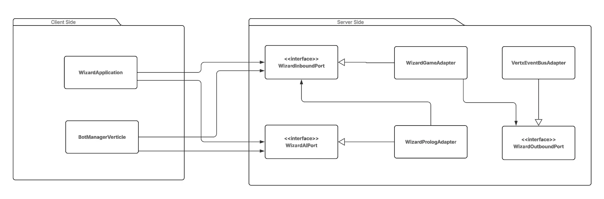
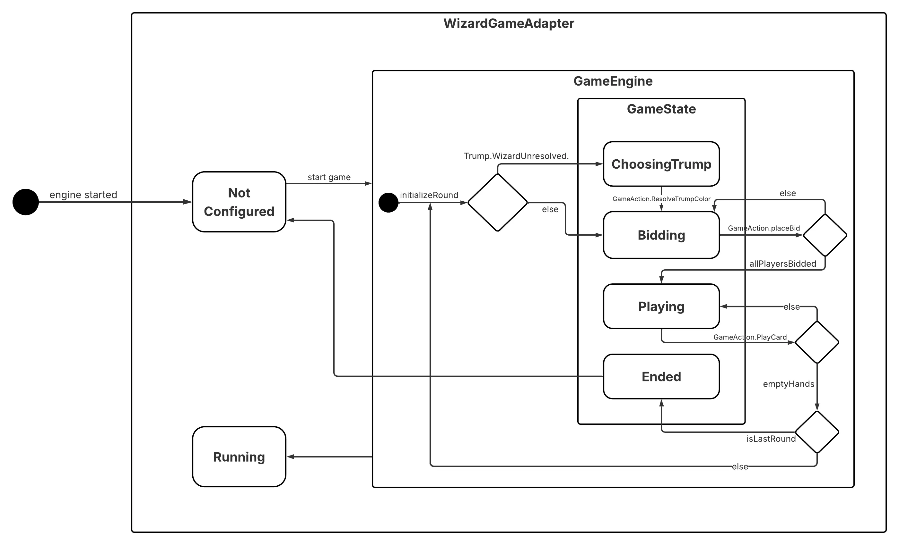

# Design Architetturale

Per quanto riguarda il design architetturale del sistema, si identificano due macro-componenti principali, i quali
vengono suddivisi a loro volta in altri sotto-componenti:

- *Engine*: gestisce la creazione e lo sviluppo di una partita di wizard. E stato realizzato come servizio, seguendo
  un'archietttura di tipo esagonale, anche conosciuta come *ports & adapters*, allo scopo di facilitarne la composizione
  con altri servizi. In particolare, l'architettura prevede i seguenti componenti:

    - *Model*: definisce la *business logic* del sistema.
    - *Port*: espone le funzionalità del modello in rapporto a uno specifico caso d'uso del servizio.
    - *Adapter*: permette l'interazione con una specifica porta attraverso una specifica tecnologia.

- *Application*: gestisce l'interazione dell'utente col servizio. In particolare, è composto da:

    - *ViewController*: gestisce l'interazione tra utente e l'applicazione.

Di seguito, si riporta l'architettura del sistema in cui l'engine può includere modelli, porte e adapter diversi.

## WizardGameAdapter & GameEngine

Di seguito viene illustrata la macchina a stati che modella il comportamento del **WizardGameAdapter** e del suo motore di gioco interno, il **GameEngine**.

- Il **WizardGameAdapter** si trova inizialmente in uno stato **Not Configured**. All'avvio della partita tramite l'evento `start game`, l'adapter passa allo stato **Running**, delegando il controllo del flusso interno al **GameEngine**.
  - Il **GameEngine** gestisce a sua volta il ciclo di vita della partita e i turni attraverso i seguenti sotto-stati i **GameState**:
  - **Inizializzazione del Round**: Il ciclo inizia con l'azione `initializeRound`. Se la carta briscola rivelata è un Mago, il sistema entra nello stato `ChoosingTrump`. Una volta che il colore viene risolto `GameAction.ResolveTrumpColor`, o se la briscola era già definita in partenza, si transita alla fase successiva.
  - **Bidding**: I giocatori effettuano le loro scommesse `GameAction.placeBid`. Il sistema cicla in questo stato finché tutti i giocatori non hanno effettuato la propria puntata `allPlayersBidded`, per poi passare alla fase di gioco effettiva.
  - **Playing**: I giocatori iniziano a calare le proprie carte `GameAction.PlayCard`. Questo stato si ripete finché le mani di tutti i giocatori non si svuotano `emptyHands`.
  - **Verifica di fine Round/Partita**: Quando le mani sono vuote, il sistema verifica se è stato appena giocato l'ultimo round previsto `isLastRound`. In caso negativo, il ciclo riparte reinizializzando un nuovo round `initializeRound`.
    Se invece è l'ultimo round, la partita termina passando allo stato Ended.
- Una volta raggiunto lo stato `Ended`, il flusso si conclude e il sistema ritorna allo stato **Not Configured** del **WizardGameAdapter**.

---

[Back to index](../../index.md) |
[Previous Chapter](./2-requirements.md) |
[Next Chapter](./4-detailed.md)
