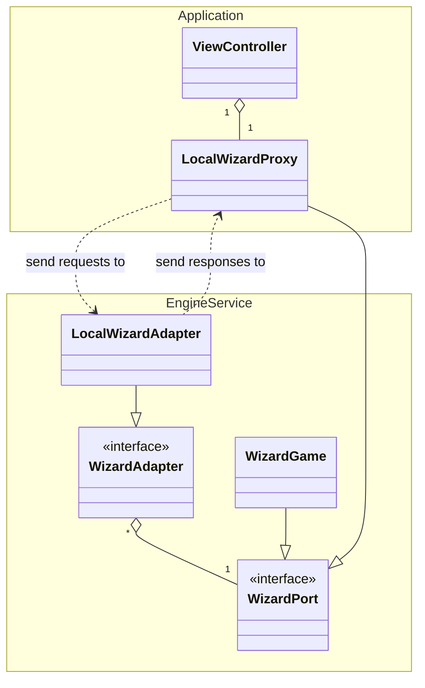

# Design Architetturale

Per quanto riguarda il design architetturale del sistema, si identificano due macro-componenti principali, i quali vengono suddivisi a loro volta in altri sotto-componenti:

- *Engine*: gestisce la creazione e lo sviluppo di una partita di wizard. E stato realizzato come servizio, seguendo un'archietttura di tipo esagonale, anche conosciuta come *ports & adapters*, allo scopo di facilitarne la composizione con altri servizi. In particolare, l'architettura prevede i seguenti componenti:

    - *Model*: definisce la *business logic* del sistema.
    - *Port*: espone le funzionalità del modello in rapporto a uno specifico caso d'uso del servizio.
    - *Adapter*: permette l'interazione con una specifica porta attraverso una specifica tecnologia.

- *Application*: gestisce l'interazione dell'utente col servizio. In particolare, è composto da:

    - *Proxy*: media l'interazione tra l'applicazione e l'engine al fine di proteggere l'utilizzatore dai cambiamenti del servizio.
    - *ViewController*: gestisce l'interazione tra utente e l'applicazione.

Di seguito, si riporta l'architettura del sistema in cui l'engine può includere modelli, porte e adapter diversi.

## Engine

Per esplicitare i vari casi d'uso, il contratto del servizio prevede le seguenti funzionalità:

- *Ottenimento dello stato del servizio*: funzionalità che permette di ottenere lo stato corrente della partita, il quale include le carte in mano al giocatore, le carte attualmente sul tavolo (la manche corrente), la carta del briscola (se presente), il round attuale, il turno del giocatore corrente, i punteggi e le scommesse/previsioni di tutti i giocatori.

- *Avvio della partita*: funzionalità che, a partire da una data configurazione (es. numero di giocatori, nomi dei partecipanti, eventuale presenza di bot), permette di inizializzare il mazzo, distribuire le carte per il round corrente e avviare la partita.

- *Ottenimento delle carte giocabili*: funzionalità che, a partire dalle carte presenti nella mano del giocatore di turno e dalla prima carta giocata nella manche attuale (che determina il seme di piombo), restituisce l'elenco delle carte che il giocatore è legalmente autorizzato a calare (rispettando l'obbligo di rispondere al seme, salvo l'uso di Wizard o Fool).

- *Scommessa sulle mani (Previsione)*: funzionalità che permette a un giocatore, all'inizio di ogni round e dopo aver visto le proprie carte e il briscola, di dichiarare il numero esatto di prese (tricks) che prevede di vincere in quel round.

- *Applicazione di una mossa (Giocata carta)*: funzionalità che applica la giocata di una specifica carta dalla mano del giocatore al tavolo, verificandone la validità. Se la giocata conclude la manche, il servizio calcola il vincitore della presa, gli assegna il punto e aggiorna il turno per la manche successiva.

- *Calcolo e aggiornamento del punteggio*: funzionalità che, alla fine di un round (quando tutte le carte distribuite sono state giocate), confronta le prese effettuate da ogni giocatore con le rispettive scommesse iniziali, calcola i punteggi positivi o negativi accumulati e, se si è raggiunto l'ultimo round, decreta il vincitore della partita.

## Eventi di Gioco

In seguito all'applicazione delle varie funzionalità vengono creati determinati eventi, ai quali è possibile sottoscriversi:

- *GameOverEvent*: evento generato per avvisare che la partita è terminata definitivamente. Viene emesso quando si conclude l'ultimo round previsto (il cui numero dipende dal numero di giocatori) e contiene la classifica finale con i punteggi totali e il vincitore del match, oppure nel caso in cui un giocatore abbandoni la partita.

- *RoundStartedEvent*: evento generato all'inizio di ogni nuovo round. Avvisa l'applicazione che il mazzo è stato rimescolato e che è necessario distribuire le nuove carte. Contiene la mano specifica del singolo giocatore (per ovvie ragioni di privacy/segretezza del gioco) e l'eventuale carta scoperta che determina il seme di trionfo per quel round.

- *BiddingStartedEvent*: evento generato per notificare che è iniziata la fase di scommessa per il round corrente. Indica alla GUI di mostrare i controlli per consentire ai giocatori di inserire il numero di prese che prevedono di fare.

- *BidPlacedEvent*: evento generato ogni volta che un giocatore effettua la propria scommessa. Permette a tutti gli altri partecipanti di vedere la previsione dell'avversario sul proprio schermo e aggiorna lo stato dei log di gioco.

- *TrickStartedEvent* (Inizio Manche): evento generato quando inizia una nuova presa (manche) all'interno del round. Determina chi è il giocatore di mano (il primo a dover calare) e resetta il tavolo visivo eliminando le carte della presa precedente.

- *CardPlayedEvent* (Tavolo Modificato): evento generato ogni volta che un giocatore cala una carta valida sul tavolo. Equivale al BoardChangedEvent degli scacchi: notifica alla GUI quale carta mostrare al centro dello schermo e a chi appartiene.

- *TrickCompletedEvent* (Presa Assegnata): evento generato quando tutti i giocatori hanno calato una carta per la manche corrente. Contiene l'identificativo del giocatore che ha vinto la presa (avendo giocato il Wizard o la carta più alta del seme di piombo/trionfo) e decreta chi aprirà la manche successiva.

- *RoundCompletedEvent*: evento generato alla fine di un round, dopo che tutte le carte in mano ai giocatori sono state esaurite. Contiene il riepilogo dei punteggi parziali del round (calcolati in base al successo o fallimento delle scommesse iniziali) e l'aggiornamento della tabella dei punteggi totali.

- *TurnChangedEvent*: evento generato per avvisare l'applicazione che il controllo del gioco è passato a un altro giocatore (sia durante la fase di scommessa che durante la fase di giocata), permettendo alla GUI di evidenziare visivamente il giocatore attivo e attivare i relativi timer o controlli di input.
