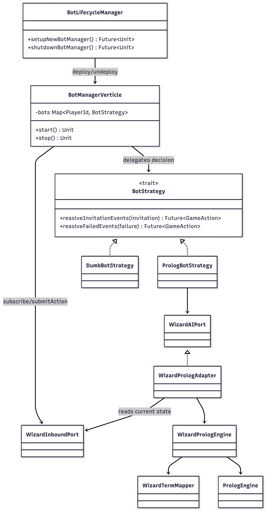

# Implementazione: Alex Mazzoni ~ @pallax03

Sin dall'inizio del progetto, mi sono occupato del coordinamento, della suddivisione e della revisione dell'architettura della Macchina a Stati Principale (FSM) del GameEngine.
Ho seguito con precisione l'inizializzazione della Continuous Integration e ho implementato, seguendo la metodologia TDD, i primi modelli di base propedeutici all'integrazione finale della FSM.

Nell'ambito dei componenti di [model.basic](#enginemodel), ho implementato in autonomia: 
- `cards`, rappresentano il dominio delle carte da gioco: [`Deck`](#deck), `Hand / Hands`.
- `gameplay`, rappresenta il dominio pubblico di gioco tra i giocatori: `Table`, [`Trump`](#trump), 

Successivamente ho coordinato e revisionato la sezione relativa alle [model.rules](#enginemodel), 
implementando nello specifico: `TableRules` la cui responsabilità sono le regole operative legate alla giocata di una carta e alla valutazione della presa.

Il mio compito successivo ha riguardato l'intera [implementazione dei bot](#bot), a partire dall'integrazione con [prolog](#prolog) fino alla realizzazione dei suggerimenti (hint) per i giocatori.
Come anticipato, ho coordinato l'architettura del GameEngine con l'obiettivo di garantire un netto disaccoppiamento tra player e bot, facilitando così la creazione di un'unica API esterna al GameEngine utilizzata da entrambi.
Grazie all'architettura finale dell'intero progetto, implementata da [@NicolaGraziotin](/docs/sections/5-implementation/nicola/index.md), il disaccoppiamento tra i due componenti attivi è risultato immediato. 
Questo approccio mi ha permesso di valorizzare la sua struttura, approfondendo e applicando il pattern _ports-and-adapters_; 
in questo modo, sia i bot sia i giocatori reali riescono a interagire con la medesima API per ottenere lo stesso tipo di risultato.

I file invece implementati in collaborazione con gli altri membri del team includono:
- Durante la fase iniziale del progetto ho implementato una versione di partenza, con l'obiettivo di fornire un approccio prevelentemente FP per la realizzazione del `GameEngine`, 
    `engine.model.core`: `GameState`, `CoreState`, `GameError`, `GameAction`.
- Implementazione di partenza degli eventi `engine.events`: `WizardEvent`, `ActionEvent`, `FailureEvent`, `LifecycleEvent`, `ProgressEvent`, in particolare gli `InvitationEvent` per i bots.
- La `engine.model.configuration.GameConfiguration` per l'aggiunta della difficoltà dei bots.
- La gui `application.scalafx`:
  - Implementazione dei miei model in componenti grafici
  - Adattamento a FXML con l'utilizzo di `application.scalafx.managers` 
  - `PresentationScript` e `PresentationQueue` utility in grado di garantire animazioni e una coda per gli eventi, garantendo coerenza nell'`EventDispatcher`

## engine.model

La prima parte dell'implementazione ha riguardato la costruzione di un modello di dominio sufficientemente espressivo
per rappresentare le entità fondamentali di Wizard senza esporre direttamente collezioni o primitive non tipizzate.

Per questo motivo diversi concetti sono stati modellati con `opaque type`, companion object ed extension methods.

#### Deck

È stato pensato sin da subito come un `opaque type` basato su `List[Card]`. Il companion object espone due factory principali:
- `Deck.create`, che crea e mescola un mazzo standard da 60 carte.
- `Deck.create(cards)`, che crea un mazzo custom rimuovendo eventuali duplicati.

L'implementazione del deck ha posto subito una sfida architetturale nel passaggio dal paradigma OOP a quello funzionale: 
come è possibile distribuire le carte a più giocatori senza mutare lo stato globale del mazzo (evitando i side-effect)?

L'operazione più rilevante, `Deck.pop(n)`, è stata risolta adottando `cats.data.State[Deck, List[Card]]`. 
Questa soluzione ha permesso di modellare la distribuzione delle carte in maniera completamente funzionale.

Prima di consolidare l'implementazione, ho esplorato come l'API pubblica potesse essere utilizzata.
I seguenti casi d'uso hanno confermato l'efficacia di questa soluzione.

```scala
for
    h1 <- Deck.pop(10)
    h2 <- Deck.pop(5)
    h3 <- Deck.pop(20)
    trumpList <- Deck.pop(1)
  yield (List(h1, h2, h3), trumpList.headOption)
  
val (remainingDeck, (hands, trump)) = dealStatic(Round.start).run(Deck()).value
```
Il primo aspetto fondamentale è l'assoluta mancanza di side-effect: grazie all'utilizzo della monade **State** di **Cats**, 
il riferimento al mazzo aggiornato viene passato implicitamente dietro le quinte ad ogni step della `for-comprehension`, senza bisogno di riassegnare variabili.

```scala
val players = List(Player("Alice"), Player("Bob"), Player("Charlie"))

for
    handsList <- players.traverse(p => Deck.pop(ROUND).map(cards => p -> cards))
    trumpList <- Deck.pop(1)
  yield (handsList.toMap, trumpList.headOption)

val (deckAfterDeal, (playerHands, trumpCard)) = dealDynamic(players, ROUND).run(Deck()).value
```

Questa seconda implementazione dimostra come gestire in modo elegante un numero variabile di giocatori. 
Tramite l'uso di `traverse`, viene applicata l'operazione con stato (`Deck.pop`) a ogni elemento della lista `players`. 
I risultati vengono accumulati restituendo le mani dei giocatori, pur mantenendo intatto il "filo" dello stato globale del mazzo che scorre da un giocatore all'altro.

Come possiamo notare, entrambe le implementazioni sfruttano la natura monadica di State. 
Questa astrazione porta con sé un ulteriore, enorme vantaggio pratico: la gestione intrinsecamente sicura dell'esaurimento delle carte. 
Se si richiedono carte da un mazzo ormai vuoto, non vengono sollevate eccezioni; 
l'operazione estrae semplicemente le carte effettivamente disponibili (o una lista vuota), propagando coerentemente lo stato.

In un gioco come Wizard questo dettaglio è cruciale: 
nell'ultimo round le carte vengono esaurite completamente per comporre le mani dei giocatori, lasciando di fatto il mazzo vuoto. 
Di conseguenza, l'ultima estrazione per definire la Trump card fallirà in modo sicuro e puramente funzionale,
restituendo un `None` senza interrompere il flusso del programma (questa difatti è anche la base di come sono state gestite le [`Trump`](#trump)).

#### Trump

In Wizard una trump di fatto può assumere le seguenti casistiche, in base alla carta estratta come trump:
- `Absent`, ad esempio durante l'ultimo turno;
- `Jester(c)`, il jester ha lo stesso comportamento di una `Trump.Absent`;
- `Standard(c)`, in questo caso il colore della carta determina il colore della trump;
- `WizardUnresolved(c)`, se la trump è un wizard il giocatore all'inizio del turno deve poter scegliere un colore a piacimento:
- `WizardResolved(c, color)`, per questo motivo questo stato copre il caso in cui il colore è stato scelto dal giocatore.

Come possiamo notare il caso `Trump.Absent` e `Trump.Jester`, a livello di regole del gioco sono la stessa cosa, 
ma la soluzione implementata permette in qualsiasi scenario di visualizzare la carta effettivamente estratta.
Preferendo per cui l'effetto realistico in cui i giocatori vedeno effettivamente la carta uscita come trump.

## Bot

La seconda parte dell'implementazione ha riguardato i giocatori controllati dal computer. L'obiettivo era evitare che i
bot diventassero parte interna del `GameEngine`: l'engine deve validare e applicare azioni, mentre i bot devono reagire
agli eventi pubblicati dal sistema e inviare normali `GameAction`.

Per questo motivo i bot sono stati progettati come componenti applicativi, collegati all'engine tramite porte.



### BotManagerVerticle / BotStrategy

`BotManagerVerticle` è il componente reattivo che tiene vivi i bot durante una partita. Alla ricezione di
`GameStarted`, registra tutti i player marcati come bot e associa a ciascuno una `BotStrategy` coerente con la
difficoltà scelta nella configurazione.

I bot rimangono in ascolto, e utilizzano la `WizardInboundPort` per inviare `GameAction` al `GameEngine`, in risposta ai seguenti eventi:
- `InvitationEvent`, per sapere quando un bot deve decidere un'azione.
- `FailureEvent`, per tentare una nuova azione quando una precedente decisione viene rifiutata dall'engine.
- `LifecycleEvent`, per creare o svuotare la mappa dei bot.

La factory `BotStrategy` incapsula la scelta della strategia:
- `DumbBotStrategy`, per una strategia semplice.
- `PrologBotStrategy`, delega tutte le decisioni a [`WizardAIPort`](#wizardaiport---wizardprologadapter).

### WizardAIPort - WizardPrologAdapter

`WizardAIPort` definisce il contratto del servizio AI.
Tutti i metodi restituiscono `Future`, perché la decisione AI può dipendere da un componente esterno o più costoso del
calcolo immediato. In questo modo il bot manager non blocca il flusso reattivo della partita.

`WizardPrologAdapter` implementa questa porta e svolge tre ruoli:
1. recupera lo stato corrente della partita tramite `WizardInboundPort`, contattando il `GameEngine`;
2. controlla che la richiesta abbia senso nella fase corrente;
3. delega la decisione a `WizardPrologEngine`, applicando fallback sicuri quando Prolog non produce un risultato valido.

Il design scelto è volutamente **stateless**: poichè sia il bot sia il player in qualsiasi momento può contattare tale design per richiedere la miglior carta da giocare ad esempio.
Il design adottato permette di non ricostruisce internamente tutta la partita, per ogni entità, che altrimenti sarebbe costoso soprattutto per i bot.

```scala
  private def onRunningPhase[T](actionName: String)(
      phaseLogic: PartialFunction[GameState, Future[T]]
  ): Future[T] =
    inboundPort.getState.flatMap:
      case WizardGameState.Running(state) =>
        phaseLogic.applyOrElse(
          state,
          _ => Future.failed(IllegalStateException(s"Cannot $actionName: invalid game phase"))
        )
      case _ => Future.failed(IllegalStateException("Game is not running"))
```

Viene utilizzata una `PartialFunction`, per fare il pattern matching e gestire automaticamente richiese invalide o stati inconsistenti.

## Prolog

La logica Prolog è stata organizzata come teoria caricata da `prolog/all.pl` ed esposta a Scala tramite due livelli:

- `util.PrologEngine`, wrapper generico intorno a tuProlog: 
  Questa interfaccia permette di trattare il backtracking Prolog come una sequenza lazy di soluzioni. 
  La funzione `extractVars` converte poi una soluzione riuscita in una mappa `nomeVariabile -> Term`, semplificando l'estrazione dei risultati.
- `WizardPrologEngine`, adapter specifico del dominio Wizard:
  È importante che nel caso non si voglia specificare un dato venga utilizzata la parola chiave `none`.
  
### Teoria (all.pl)

Per garantire performance e coesione, la logica di validazione delle mosse è stata replicata in Prolog.
Questo rende l'agente del tutto autonomo nell'esplorazione dell'albero di gioco,
permettendogli di calcolare mosse e probabilità internamente senza dover delegare i controlli al core in Scala (TableRules).

Tutte le API sono state implementate per garantire sempre un risultato valido.

#### choose_trump\2

Seleziona il colore di trump migliore, in caso di una mano senza carte standard, genera dei colori con `is_valid_color(Color)`.
Tramite il meta-predicato `findall`, estrae le frequenze dei colori e sceglie quello dominante.

#### place_bid\3

Stima le prese che il bot riuscirà a fare. 
Filtra e conta le carte della mano, dividendole tra prese certe `safe_trick` (come Wizard e briscole alte) e probabili `risky_trick`.

È stata implementata anche **adjust_bid\3**, pensata per coprire il caso in cui la dichiarazione calcolata venga rifiutata dalle regole del tavolo.
Aggiusta la scommessa di un punto al rialzo o al ribasso, analizzando la flessibilità della mano.

#### best_playable_card\7

Le sue clausole sono ordinate gerarchicamente per gestire prima i casi reattivi (quando c'è già una carta vincente sul tavolo) e poi i casi proattivi (apertura della presa).

In questa fase è stato fondamentale l'utilizzo del Cut (!) di Prolog. L'API deve restituire una e una sola mossa ottimale.
Senza il cut, il motore Prolog, tramite il meccanismo di backtracking, potrebbe proporre carte sub-ottimali se interrogato per soluzioni multiple.

---

[Back to index](../../../../index.md) |
[Previous Chapter](../index.md) |
[Nicola Graziotin](../nicola/index.md) |
[Francesco Marcatelli](../francesco/index.md) |
[Next Chapter](../../6-testing.md)
