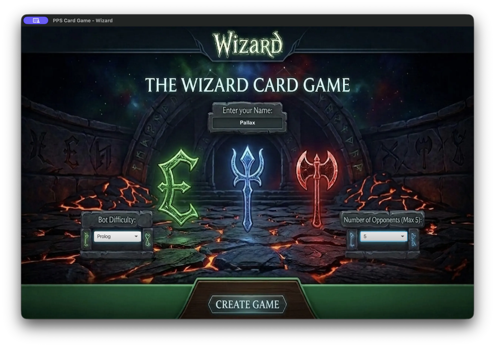
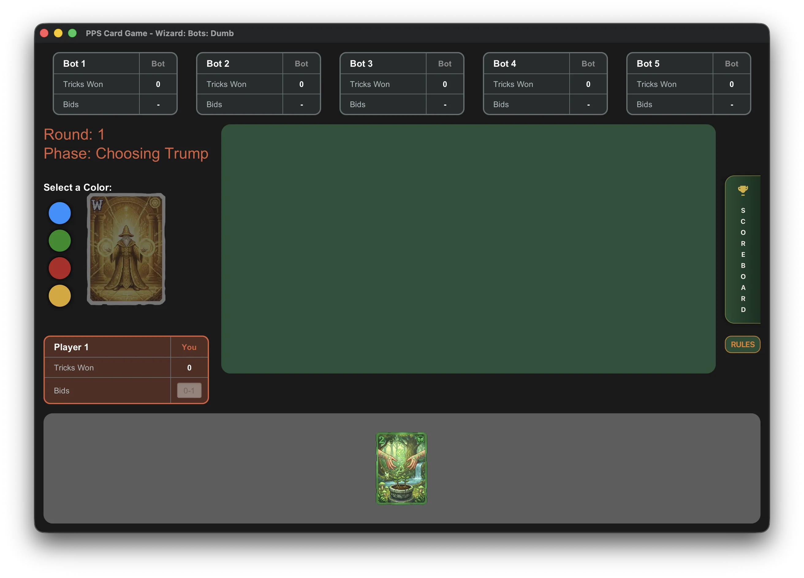
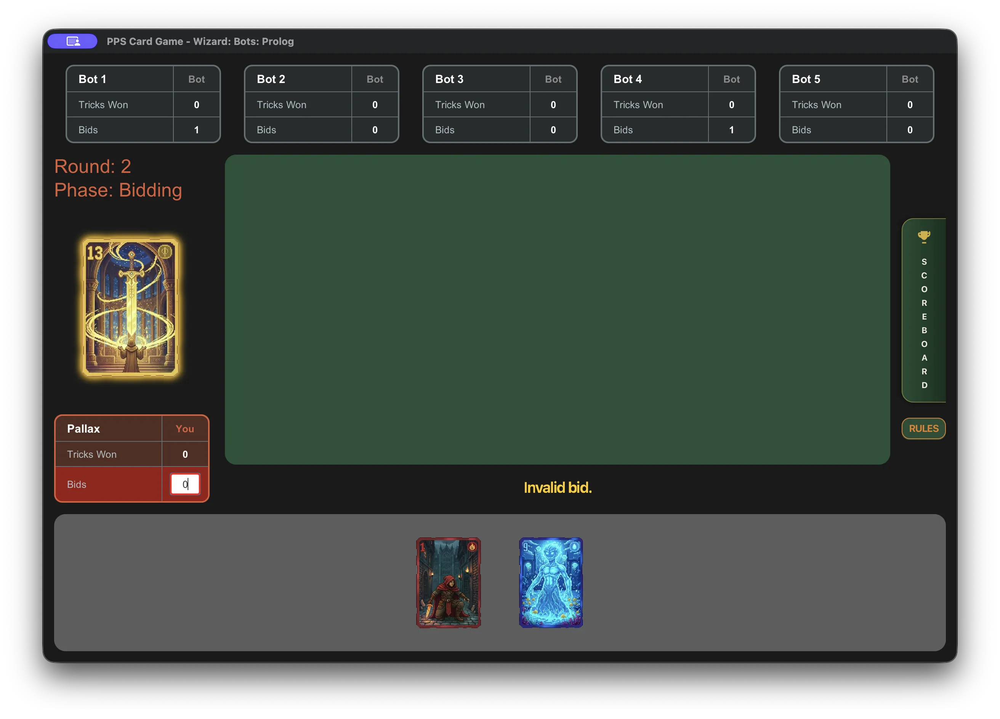
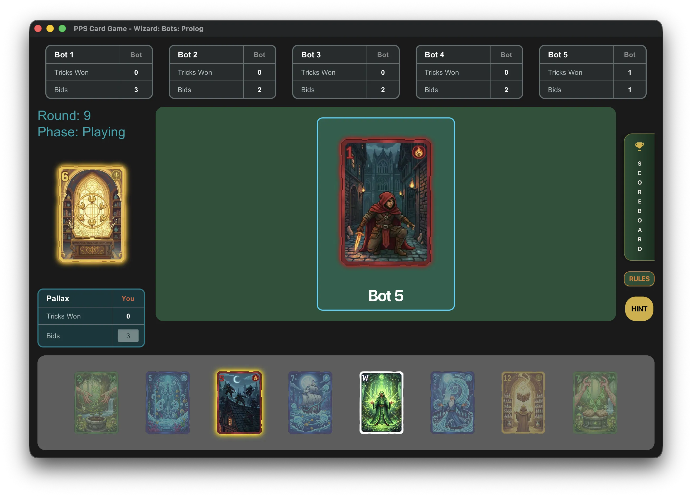
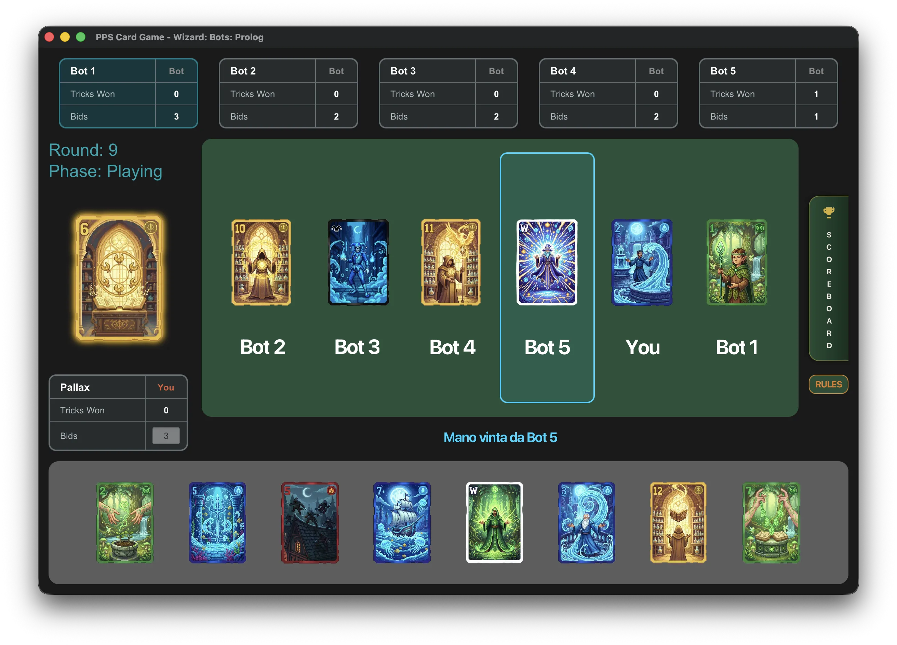
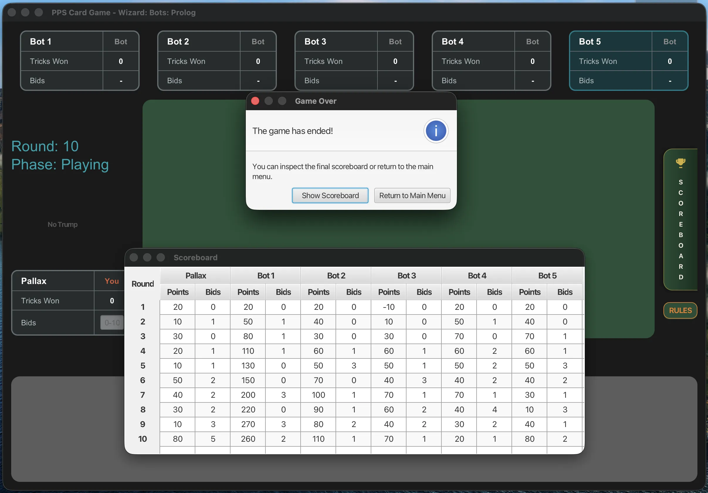

# 7 - Application

L'implementazione in scalaFX, realizzata è una gui per poter giocare in modalità singleplayer contro un numero variabile di bots.
Una partita a Wizard si può giocare da un numero minimo di 3 a 6 persone totali.

## Mockups

Sono stati realizzati dei mockups basilari, per capire come realizzare in maniera responsive e intuitiva una GUI basilare, 
durante l'esecuzione di una partita. 

## Flusso di Gioco

### Avvio della partita

Per poter avviare una partita, è necessaria una configurazione iniziale, modellata dalla classe `GameConfiguration`, in
cui vengono indicate le seguenti informazioni:

- PlayerName: indica il nome del giocatore.
- NumeberOfBots: indica il numero di bot presenti nella partita.
- BotsDifficulty: indica la difficoltà dei bot presenti nella partita.

### Svolgimento della partita

Una volta avviata la partita, il flusso di gioco si articola in una serie di round gestiti dinamicamente dal `GameEngine`.
Ogni round segue le fasi canoniche di Wizard, dove l'utente interagisce con il tavolo di gioco per compiere scelte strategiche,
dalla selezione del colore di briscola alla formulazione delle previsioni, fino a giocare le proprie carte in mano.
L'interfaccia fornisce un feedback visivo immediato per ogni azione,

#### Fase di Choosing Trump

In questa fase, qualora venga pescata una carta che richiede la scelta del seme di briscola,
l'interfaccia permette al giocatore di selezionare il colore desiderato tramite gli appositi pulsanti colorati situati sul lato sinistro della carta.

#### Fase di Bidding & Invalid Bid

All'inizio di ogni round, i giocatori devono effettuare le loro previsioni (bids) sul numero di prese che stimano di vincere.
L'interfaccia integra un sistema di validazione in tempo reale:
se l'utente inserisce un valore non consentito dalle regole del gioco,
l'azione viene bloccata e compare il messaggio di avviso "Invalid bid.", richiedendo un nuovo inserimento.

#### Playing a Card & Best Card Hint 

Durante la fase di gioco vera e propria, gli utenti selezionano e calano le carte dalla propria mano.
È stata implementata una funzionalità di supporto per il giocatore: cliccando sul pulsante "HINT" sulla destra,
viene inviato un segnale all'adapter AI per il giocatore e viene elaborato lo stato attuale della partita,
suggerendo la carta ottimale da giocare, evidenziandola graficamente all'interno della mano.

#### Trick Won

Al termine di ogni mano, l'interfaccia mette in risalto la carta vincente al centro del tavolo.
Un testo a schermo indica esplicitamente quale giocatore o bot si è aggiudicato la presa,
e le relative statistiche "Tricks Won" nei pannelli dei giocatori vengono aggiornate istantaneamente.

### Fine del gioco e Scoreboard

Una volta concluso l'ultimo round previsto, compare una finestra di dialogo "Game Over" che segnala la fine della partita.
Da qui, cliccando su "Show Scoreboard", l'utente può consultare la classifica finale:
una tabella di riepilogo dettagliata che mostra l'evoluzione dei punteggi e delle previsioni round per round per ogni partecipante.

---

[Back to index](/index.md) |
[Previous Chapter](/docs/sections/6-testing.md) |
[Next Chapter](/docs/process/product_backlog.md)